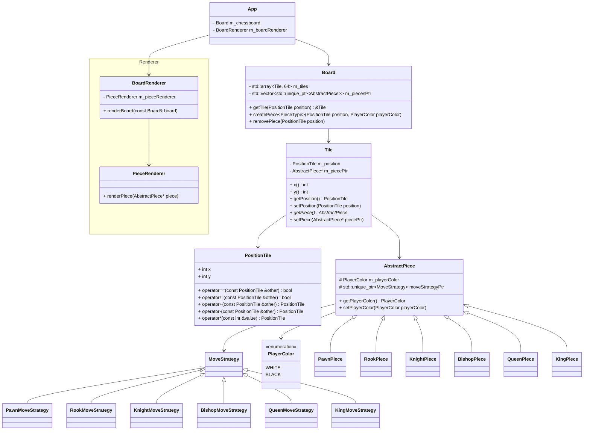

# UML

```mermaid
classDiagram
    class App {
        - Board m_chessboard
        - BoardRenderer m_boardRenderer
    }

    class Board {
        - std::array~Tile, 64~ m_tiles
        - std::vector~std::unique_ptr~AbstractPiece~~ m_piecesPtr

        + getTile(PositionTile position) &Tile
        + createPiece~PieceType~(PositionTile position, PlayerColor playerColor)
        + removePiece(PositionTile position)
    }

    class PositionTile {
        + int x
        + int y

        + operator==(const PositionTile &other) bool
        + operator!=(const PositionTile &other) bool
        + operator+(const PositionTile &other) PositionTile
        + operator-(const PositionTile &other) PositionTile
        + operator*(const int &value) PositionTile
    }

    class Tile {
        - PositionTile m_position
        - AbstractPiece* m_piecePtr

        + x() int
        + y() int
        + getPosition() PositionTile
        + setPosition(PositionTile position)

        + getPiece() AbstractPiece*
        + setPiece(AbstractPiece* piecePtr)
    }

    class AbstractPiece {
        # PlayerColor m_playerColor
        # std::unique_ptr~MoveStrategy~ moveStrategyPtr

        + getPlayerColor() PlayerColor
        + setPlayerColor(PlayerColor playerColor)
    }

    class MoveStrategy {
    }

    class PawnMoveStrategy {
    }

    class RookMoveStrategy {
    }

    class KnightMoveStrategy {
    }

    class BishopMoveStrategy {
    }

    class QueenMoveStrategy {
    }

    class KingMoveStrategy {
    }

    class PlayerColor {
        <<enumeration>>
        WHITE
        BLACK
    }

    namespace Renderer {
        class BoardRenderer {
            - PieceRenderer m_pieceRenderer
            + renderBoard(const Board& board)
        } 
        
        class PieceRenderer {
            + renderPiece(AbstractPiece* piece)
        }
    }

    App --> Board
    App --> BoardRenderer
    BoardRenderer --> PieceRenderer
    Board --> Tile
    Tile --> AbstractPiece
    Tile --> PositionTile
    AbstractPiece --> MoveStrategy
    AbstractPiece --> PlayerColor
    MoveStrategy <|-- PawnMoveStrategy
    MoveStrategy <|-- RookMoveStrategy
    MoveStrategy <|-- KnightMoveStrategy
    MoveStrategy <|-- BishopMoveStrategy
    MoveStrategy <|-- QueenMoveStrategy
    MoveStrategy <|-- KingMoveStrategy
    AbstractPiece <|-- PawnPiece
    AbstractPiece <|-- RookPiece
    AbstractPiece <|-- KnightPiece
    AbstractPiece <|-- BishopPiece
    AbstractPiece <|-- QueenPiece
    AbstractPiece <|-- KingPiece
```